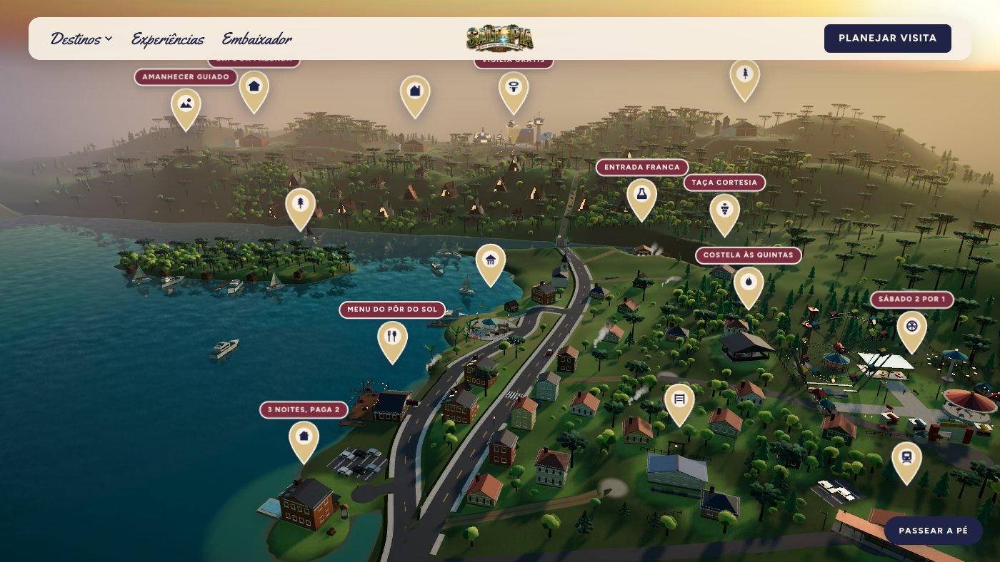
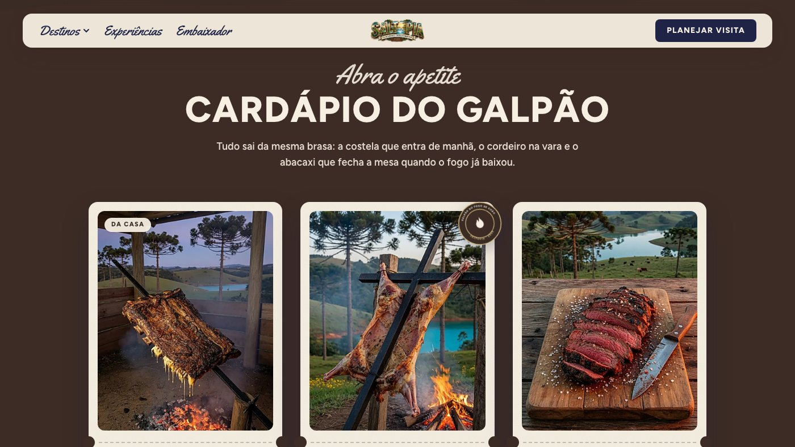

# Saltopia

An immersive 3D web experience for **Saltopia**, an imagined community at the Salto do
Rio Caveiras reservoir outside Lages, in the Serra Catarinense. The home page is not a
page that scrolls: it is a navigable 3D map. Every place on it has a pin, every pin flies
the camera and opens a card, and every card leads to a page about that place: its story,
its photographed menu, its experiences and its gallery.

It started as a fifth-semester academic project, presented as a live demo, and is meant
to become a product that presents a whole destination and its establishments together.
[`docs/requirements/vision.md`](docs/requirements/vision.md) explains the intent. The interaction model follows
`visitmeatopia.com`; the architecture and timing are reproduced, and no asset, string,
name or colour is copied.





**Documentation** follows software-engineering standards and is indexed in
[`docs/README.md`](docs/README.md):
- requirements: vision and scope, an ISO/IEC/IEEE 29148 SRS and a traceability matrix;
- architecture: arc42 with C4 diagrams, 15 ADRs, and the data model with an ER diagram;
- an ISO/IEC/IEEE 29119-3 test plan;
- manuals for visitors, for partner establishments, and for installation and operation
  (in Portuguese).

The process is in [`CONTRIBUTING.md`](CONTRIBUTING.md), and the history in
[`CHANGELOG.md`](CHANGELOG.md).

---

## Getting started

Requirements: Node 20+, Docker, and Python 3 with Pillow (only to rebuild the wordmark).

```bash
docker compose up -d          # MariaDB on 3307 and Adminer on 8080
cd web
npm install
cp .env.example .env          # DATABASE_URL points at 127.0.0.1:3307
npx prisma migrate dev        # create the schema
npm run db:seed               # 15 places, 25 experiences, 135 menu items
npm run dev                   # http://localhost:3001
```

The port is **3307**, not 3306: a native `mysqld` already owns 3306 on the development
machine, and pointing Prisma at it fails with an authentication error that never mentions
the port. See `CLAUDE.md` for that and two other traps.

## Commands

| Command | What it does |
| --- | --- |
| `npm run dev` | Development server on 3001 |
| `npm run build` / `npm start` | Production build and server |
| `npm run db:seed` | Rewrite every place, experience and menu item from `prisma/content/` |
| `npm test` | Unit tests of the pure logic: the world, walk mode, colour rules, content, menus, the contest (Node's test runner through tsx) |
| `npm run test:coverage` | The same, with line, branch and function coverage |
| `npm run check` | Layout, assets, types and lint in one go |
| `npm run check:layout` | Fails on overlapping buildings, buildings on roads, boats that collide, a house beside its twin, anything of the land in the water or of the water on land, piers and stilt cabins under water, pools across a road |
| `npm run check:assets` | Fails when a place or experience points at an image that is not on disk; counts the photographs each gallery and menu still lacks |
| `npm run build:logo` | Rebuild both wordmark files from `logo.png` |
| `npm run build:crests` | Rebuild the place crests from the pin glyphs |
| `npm run images:prompts` | Write `docs/grok/manifest.jsonl`: one complete brief per photograph still missing |
| `npm run images:sharpen` | Convert PNG/JPEG to WebP, sharpen new or replaced photographs, and drop the stale optimised copies |

`npx tsc --noEmit` only passes **after** `npm run build`: Next generates its route types
into `.next/types` during the build.

## Where things are

```
.
├── CLAUDE.md                  project rules: spec-first, clean code, the local traps
├── docs/
│   ├── README.md              the documentation index, by discipline - start here
│   ├── requirements/          vision and scope, SRS, traceability matrix
│   ├── architecture/          arc42 description, ADRs, data model, building blocks
│   ├── testing/               test plan and completion report
│   ├── manual/                manuals: visitor, partner, installation and operation (pt-BR)
│   ├── image-prompts.md       the photographic briefs behind every page image
│   └── grok/                  how to generate missing photographs with Grok
├── CONTRIBUTING.md            the workflow: spec, code, test, document, commit
├── CHANGELOG.md               what changed, by date and OpenSpec change
├── openspec/                  the specs and the changes that built this, one per feature
├── logo.png                   the wordmark's source artwork
└── web/
    ├── prisma/                schema, migrations, seed
    │   └── content/           the words: places, experiences, menus
    ├── scripts/               the checks and the asset builders
    ├── tests/                 unit tests (npm test)
    └── src/
        ├── app/               routes: /, /[place], /[place]/experiencias/[x], /embaixador…
        ├── components/        world-map/ (the hub), walk-mode/, content/ (the pages), contest/
        ├── lib/world/         the world itself: terrain, roads, buildings, materials
        ├── lib/contest/       the contest's copy, calendar and invitation rules
        └── lib/places.ts      the only module that talks to the database about places
```

## How it fits together

The **hub** (`/`) is a `@react-three/fiber` canvas. Nothing in the world is downloaded:
the terrain, the roads, every building, tree and boat, the sky and every texture are
generated at runtime from the numbers in `src/lib/world/`. The world's 3D payload is
therefore zero bytes, which is the whole reason it can be inspected, changed and reviewed
like any other code. The sky is a physically based sunset that also lights the scene, the
lake is a planar reflection, and three quality tiers step down on their own on a slow
machine (`?quality=high|medium|low` pins one) - see
`openspec/changes/elevate-world-realism/`.

The **pins** are HTML above the canvas, not objects inside it. A projector writes each
pin's screen position straight to its DOM node every frame, outside React's render cycle.

The **pages** (`/[place]`, `/[place]/experiencias/[experience]`, `/embaixador`) scroll
normally and create no WebGL context. A place page is built around the place's own
colour, and is made of:
- a pinned hero;
- a welcome band with prints scattered over the faded place;
- a ribbon;
- the menu on a block of the place's colour, whose items open larger;
- the experiences as an itinerary;
- a gallery and a postcard to share.

`/embaixador` is a fictional ambassador contest, and a card invites to it once per visit.
Navigation between pages is a full document load, which is what lets the browser play the
iris transition as a cross-document view transition.

The interface palette is night, wine and champagne on cream paper, and every place adds
its own colour. None of them may come near the reference's colours:
`tests/palette.test.ts` and `tests/content.test.ts` measure that.

`docs/architecture/README.md` describes the architecture (arc42, C4), and
`docs/architecture/building-blocks.md` explains the parts that are not obvious from the file names — why
roads are graded into the terrain, why hills that carry buildings are terrain, and the
traps that took the longest to find.

## Walk mode

From the map, **Passear a pé** opens the character creator: one of six people, outfit
colour, skin tone and a name. The character is put down by the square.

| Input | What it does |
| --- | --- |
| Arrows or W A S D | Walk, relative to the camera |
| Shift | Run |
| Drag / wheel | Turn the camera round the character / bring it nearer |
| Click or tap the ground | Walk there |
| A pin, or **Passaporte · Lugares** | Walk to that place on your own |
| E, or **Visitar** | Open the card of the place you have arrived at |
| Stick (touch screens) | Walk; push to the rim to run |

The passport counts the places visited and is kept in the browser. Opening a place's page
on foot and coming back resumes the walk where it was - see
`openspec/changes/add-walking-character/`.

The community's people are the same six characters: fifteen townsfolk who stroll round the
square, along the pavements and down the fairground, or stand talking and gesturing, and
who stop and wave when the visitor comes near - see `openspec/changes/add-living-townsfolk/`.
The people are the only downloaded 3D files, fetched after the world has been drawn; if
they cannot be fetched, the hub goes on without them.

## Data

MariaDB through Prisma 7 with an explicit driver adapter: three tables, `place`,
`experience` and `menu_item`. `src/lib/places.ts` is the only module that imports the
client. Everything else works with the `Place`, `Experience` and `PlaceMenu` types, so the
database stays a replaceable detail. [`docs/architecture/data-model.md`](docs/architecture/data-model.md) documents
every column, the rules the tests hold, and how the model should grow into a product's.

To change the content (copy, colours, offers, menus, which places exist), edit
`prisma/content/places.ts` or `prisma/content/menus.ts` and run `npm run db:seed`. The
seed is authoritative: it rewrites every field on every run and deletes places it no
longer carries.

## Images

Every image is built here and committed; nothing is fetched at runtime.

- **Photographs**: 268 in all.
  - Place heroes, experience pictures and each place's gallery of six.
  - Nine per place for the menu (`public/images/menu/<place>/<item>.webp`), and three
    for the contest page.
  - All were generated with Grok from the briefs in `docs/image-prompts.md` and the
    content modules.
  - `npm run images:prompts` lists whatever is missing as a manifest that Grok works
    through on its own (`docs/grok/README.md`).
  - A gallery is just a folder (`public/images/places/<slug>/01.webp` … `06.webp`), so
    adding a picture is dropping a file in.
  - A menu item whose photograph has not arrived shows a drawn stand-in instead of a
    broken image.
- **Crests**: SVGs drawn from the pin glyphs, in each place's colour, by
  `npm run build:crests`.
- **Wordmark**: two files cut from `logo.png` by `npm run build:logo`,
  `saltopia-wordmark.png` on a faded card for the map and `saltopia-wordmark-flat.png`
  cut out for the header and footer.

**After adding or replacing any photograph, run `npm run images:sharpen`.** The generator
cannot exceed 1280×720, so what lands here is always an enlargement — a file knocked down
to 1280 and back loses almost nothing, which is what an interpolated image does.
Enlarging cannot invent detail, but it smears the edges that were photographed, and the
pass puts those back. It skips what it has already sharpened, catches a replaced file by
its digest, and ends by emptying `web/.next/dev/cache/images`.

That last step is the one that costs an afternoon if it is forgotten: the optimiser keys
its cache on the request URL and not on the file behind it, so a photograph replaced in
place keeps serving the old pixels through a hard refresh, a restarted server and a
cleared browser.

## What is not built yet

- **The static fallback for devices without WebGL2.** It is a spec requirement and the
  largest open item; the hub currently assumes a working WebGL2 context.
- **Pin occlusion.** A pin whose place is behind a hill still draws.
- **A contrast test over every token pairing.** Today night on mist, champagne on night
  and each place colour against pale text are tested.
- **Anything for real partners**: accounts, a partner panel, prices, opening hours, a
  real contest. See the road to a product in `docs/requirements/vision.md` and
  `docs/architecture/data-model.md`.

## Licence and provenance

Academic work. The wordmark and the page photographs were generated for this project. The
world's geometry is generated by the code in this repository. The six walk-mode characters
are CC0 models by Quaternius; `web/public/models/CREDITS.md` records where each came from
and how it was processed.
