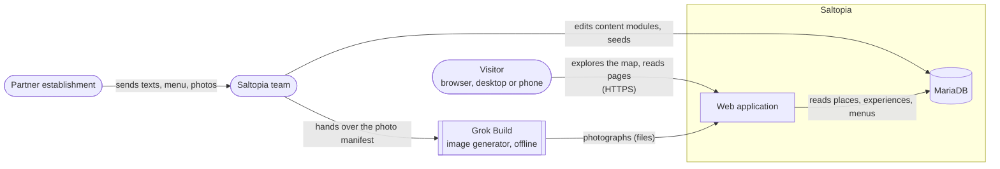
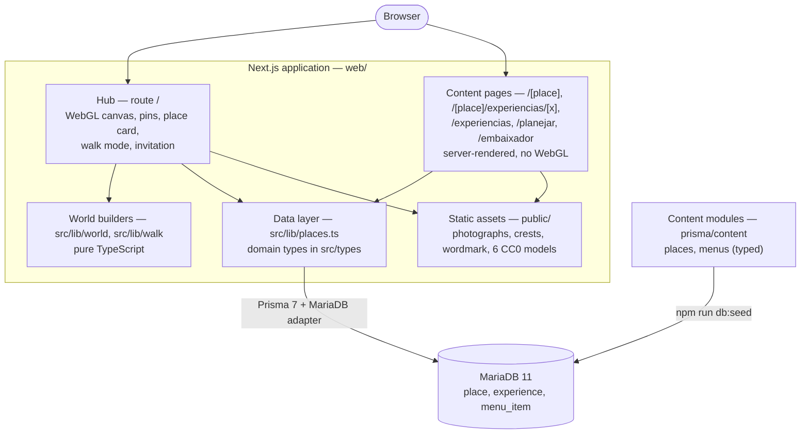
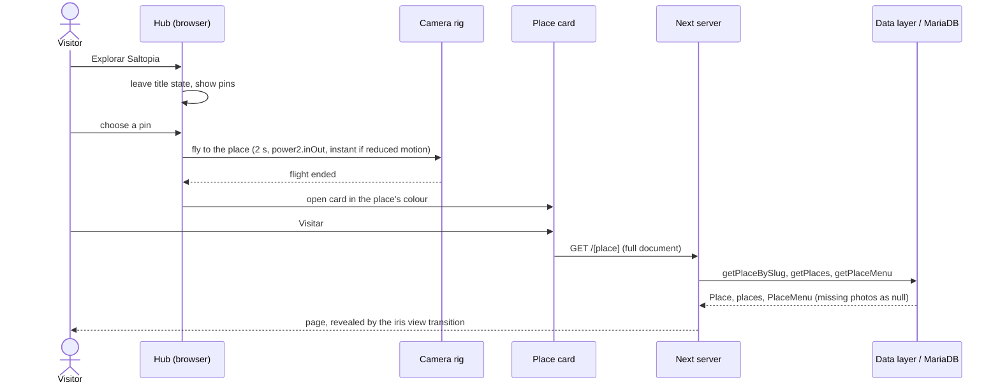
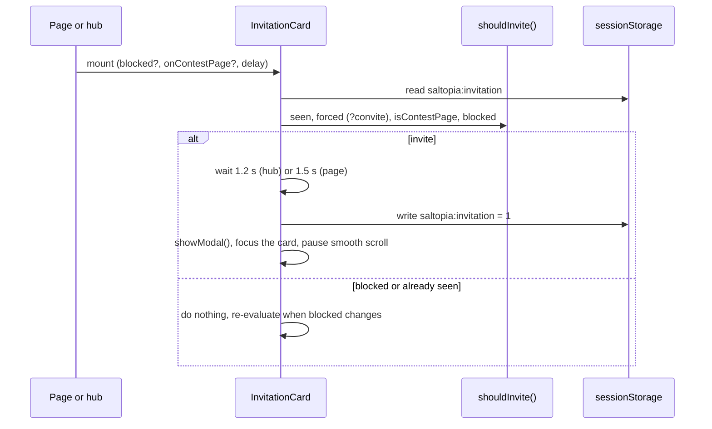
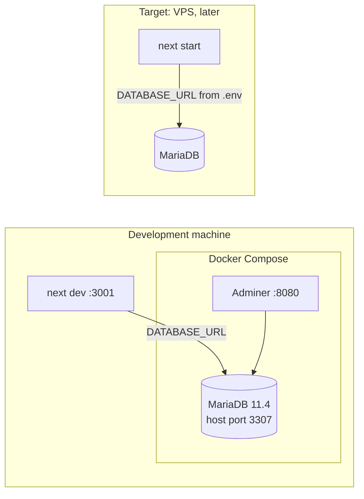

# Saltopia — Architecture

| | |
| --- | --- |
| Document | Architecture description, following the arc42 template (v8), with C4 diagrams |
| Version | 1.0, 2026-09-28 |
| Detail | [`building-blocks.md`](building-blocks.md) (code map and the rules that cost the most) · [`data-model.md`](data-model.md) · [`decisions/`](decisions/README.md) (ADRs) |

## 1. Introduction and goals

Saltopia presents a community as an explorable 3D map with one page per establishment.
The requirements are in [`../requirements/srs.md`](../requirements/srs.md), and why the
product exists is in [`../requirements/vision.md`](../requirements/vision.md).

**Quality goals**, in priority order:

| # | Quality goal (ISO/IEC 25010) | Motivation |
| --- | --- | --- |
| 1 | **Reliability** on untested hardware | Presented live on a machine nobody has tested: the hub must not freeze, blank or break (NFR-01, NFR-09, NFR-11) |
| 2 | **Accessibility** | Reduced motion never blocks a destination; everything works by keyboard (NFR-04 to NFR-07) |
| 3 | **Maintainability** | It becomes a product: content is data, the database sits behind one layer, and every change has a spec (NFR-12, NFR-13, DC-06) |

**Stakeholders:** see `vision.md` §3.1.

## 2. Constraints

The technical and organisational constraints are DC-01 to DC-08 in the SRS §4:
- the stack;
- the palette;
- type and shape;
- the language rule;
- spec-first process;
- originality;
- CC0 assets.

## 3. Context and scope

C4 level 1, the system context:

- **In scope:** the web application and its database.
- **Out of scope for the initial release:** accounts, partner self-service, payment,
  booking and analytics (`vision.md` §2.4). The image generator is used offline to produce
  content, and the running system never calls it.

## 4. Solution strategy

| Goal | Approach | ADR |
| --- | --- | --- |
| Reliability on unknown hardware | Generate the world in code (no 3D downloads); quality tiers that only step down; contain failures (stand-ins, error boundaries) | [0002](decisions/0002-generate-the-world-in-code.md), [0013](decisions/0013-quality-tiers-step-down.md), [0008](decisions/0008-asset-paths-are-promises.md) |
| An interface over the world that stays accessible | Pins as HTML projected over the canvas | [0003](decisions/0003-pins-as-projected-html.md) |
| The reference's page choreography without experimental APIs | Full-document navigation with a native view transition | [0004](decisions/0004-full-document-navigation.md) |
| A data source that can be replaced | One data layer over MariaDB, with domain types as the contract | [0005](decisions/0005-data-layer-over-mariadb.md), [0007](decisions/0007-menu-off-the-place-type.md) |
| Content that can be checked and grown | Typed content modules, seeded, with tests over them | [0006](decisions/0006-content-as-typed-modules.md) |
| Behaviour that can be defended | Spec-first development with OpenSpec | [0009](decisions/0009-spec-driven-development.md) |
| Originality that cannot drift | The night palette and a colour-distance test | [0010](decisions/0010-night-palette-and-colour-distance.md) |

## 5. Building block view

C4 level 2, the containers:

| Block | Responsibility | Main modules |
| --- | --- | --- |
| Hub | The 3D map, pins, fly-to, place card, walk mode, townsfolk, invitation | `components/world-map/`, `components/walk-mode/` |
| Content pages | The place, experience and contest pages; the shared header and footer | `app/`, `components/content/`, `components/contest/` |
| Data layer | The only access to the database; maps records to domain types | `lib/places.ts`, `lib/public-file.ts`, `types/` |
| World builders | Terrain, roads, buildings, trees, water, sky: pure data in, geometry out | `lib/world/` |
| Walk logic | Movement, heights, routes, townsfolk behaviour: pure functions | `lib/walk/` |
| Page logic | Colour rules, menu and print layout, the contest's calendar and invitation rules | `lib/colour.ts`, `lib/menu-layout.ts`, `lib/contest/` |
| Content | Words, colours, menus and photo briefs | `prisma/content/`, `lib/contest/content.ts` |
| Tooling | Checks and asset builders | `scripts/` |

[`building-blocks.md`](building-blocks.md) goes down a level, into the world's modules
and their dependency order, the checks, and the page bands.

## 6. Runtime view

### 6.1 From the map to a place page

### 6.2 The contest invitation

## 7. Deployment view

- **Local:** the database runs in Docker on port 3307 (a native server holds 3306 on the
  development machine). `prisma migrate dev` needs the shadow-database grant in
  `docker/mariadb-init/`.
- **Target:** a VPS running `prisma migrate deploy`, with no shadow grant for the
  production user. The move is a change of `.env` only (NFR-15).
- **Rendering:** place and experience pages are statically generated at build time.
  `/embaixador` revalidates hourly so its calendar follows the date.

## 8. Crosscutting concepts

| Concept | How it works | Where |
| --- | --- | --- |
| Design tokens | Every colour, radius and duration is a CSS custom property; components never use a literal brand colour | `app/globals.css`; `design-system` spec |
| Place theme | A place's accent is expanded into wash, veil, deep and ink tints on the page root; no band knows which place it draws | `components/content/place-theme.tsx` |
| Reduced motion | Motion is declared under `prefers-reduced-motion: no-preference`; a hook exposes the setting to scripts; no destination depends on motion | `hooks/use-prefers-reduced-motion.ts`; `design-system` spec |
| Failure containment | Missing photographs become drawn stand-ins; character models load behind an error boundary; unavailable storage is ignored | ADR-0008; `components/walk-mode/`; `lib/walk/storage.ts` |
| Modal dialogs | Native `<dialog>` with `showModal()`; focus restored by hand on close; smooth scroll paused while open | `menu-grid.tsx`, `invitation-card.tsx`, `lib/smooth-scroll.ts` |
| Language | Code in English, everything a visitor reads in pt-BR; constants hold Portuguese strings | `CLAUDE.md` §4 |
| Caching | Image URLs are cache keys (server and browser); a changed image gets a new name | `CLAUDE.md` §3 |
| Pure logic | Everything that can be decided without a browser is a pure, tested function | `lib/world`, `lib/walk`, `lib/contest`, `lib/menu-layout.ts`, `lib/colour.ts` |

## 9. Architecture decisions

See [`decisions/README.md`](decisions/README.md): fourteen ADRs, each linked to the design
section it came from.

## 10. Quality requirements

The quality scenarios are the non-functional requirements NFR-01 to NFR-15 in
[`../requirements/srs.md`](../requirements/srs.md) §3, each with its source and status.
How they are verified is in [`../testing/test-plan.md`](../testing/test-plan.md).

## 11. Risks and technical debt

| # | Risk or debt | Impact | Plan |
| --- | --- | --- | --- |
| 1 | No fallback without WebGL (NFR-11) | A visitor without WebGL2 cannot use the hub | The largest open item; the founding change's tasks 3.1–3.3 |
| 2 | Pins are not hidden behind terrain (FR-09) | A pin can show over a hill | Raycast occlusion (task 8.4) |
| 3 | Performance not measured on the target hardware (NFR-01) | 60 fps is unconfirmed | Measure on integrated graphics before the presentation |
| 4 | Browser verification is scripted but not in the repository | Checks cannot be re-run by anyone else | Move the capture scripts into an end-to-end suite (test plan §10) |
| 5 | Specs are not yet archived into `openspec/specs/` | The current truth is spread over several changes | Archive in order, starting with `add-serranopolis-experience` once its open tasks close |
| 6 | Offers are a string; photographs are path conventions; `crest_image` is unused | Limits the product | Data-model product steps 2 and 5 |
| 7 | Not every token pairing has a contrast test (NFR-04) | A future token could fail WCAG unnoticed | Extend `palette.test.ts` to every pairing |

## 12. Glossary

See the definitions in [`../requirements/srs.md`](../requirements/srs.md) §1.5.
