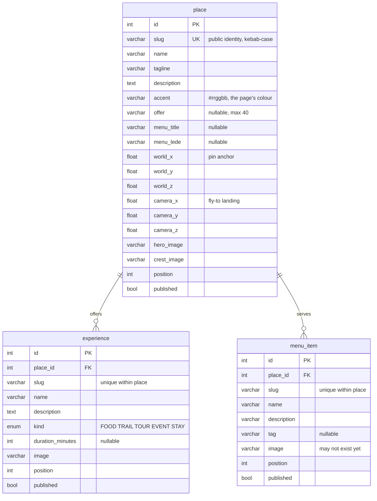

# Saltopia — data model

| | |
| --- | --- |
| Document | Logical data model and data dictionary |
| Version | 1.0, 2026-09-28 |
| Related | [`README.md`](README.md) (architecture) · [`../requirements/srs.md`](../requirements/srs.md) §6 · ADR [0005](decisions/0005-data-layer-over-mariadb.md), [0006](decisions/0006-content-as-typed-modules.md), [0007](decisions/0007-menu-off-the-place-type.md), [0008](decisions/0008-asset-paths-are-promises.md) |

What Saltopia stores, where each kind of data lives, the rules that hold it together, and
how the model should grow when the assignment becomes a product. The schema itself is
`web/prisma/schema.prisma`; this document is the explanation it cannot carry.

## At a glance

Entity–relationship diagram (Mermaid; renders on GitHub):



Beside the rows, on disk:

```
public/images/heroes/<place>.webp
public/images/crests/<place>.svg
public/images/experiences/<experience>.webp
public/images/menu/<place>/<item>.webp
public/images/places/<place>/01..06.webp   (gallery; not in the database)
public/images/contest/*.webp               (contest page; paths in lib/contest/content.ts)
```

A **place** is a point of interest on the map and an establishment in the community. An
**experience** is something to book or do there, and has a page of its own. A **menu
item** is something the place serves or sells. It is shown on the place's page and opened
there, with no page of its own.

## Tables

Names are English `snake_case`. SQL reserved words are avoided on purpose: `position`
instead of `order`, `kind` instead of `type`. Every table has `created_at` and
`updated_at`. Schema changes go through versioned migrations (`web/prisma/migrations/`),
never `db push`.

### `place`

| Column | Type | Meaning |
| --- | --- | --- |
| `id` | int, PK | Internal identity. Never shown and never in a URL. |
| `slug` | varchar(96), unique | The public identity: `/praca-do-pinhao`. Kebab-case ASCII. |
| `name` | varchar(120) | "Praça do Pinhão". |
| `tagline` | varchar(200) | One line; the ribbon on the page repeats it. |
| `description` | text | The story told in the welcome band and on the map's card. |
| `accent` | varchar(9) | The place's own colour, `#rrggbb`. Every band of its page is mixed from it. See "Invariants". |
| `offer` | varchar(40), null | A short offer shown as a ribbon on the pin and the card. Most places have none, which is what makes the rest stand out. |
| `menu_title` | varchar(80), null | The menu's heading, in the place's words: "Cardápio do galpão". Null means no menu. |
| `menu_lede` | varchar(240), null | One sentence under the heading. |
| `world_x`, `world_y`, `world_z` | float | Where the pin is anchored in the 3D world. |
| `camera_x`, `camera_y`, `camera_z` | float | Where the camera lands when it flies there. Authored rather than computed, because each place wants its own framing. |
| `hero_image` | varchar(255) | Path of the full-screen photograph. |
| `crest_image` | varchar(255) | Path of the crest file. Pages draw the crest inline in the place's colour; the file exists for anything outside the page that needs it. |
| `position` | int | Order in menus and listings. |
| `published` | bool | Unpublished places exist in the database and nowhere on the site. |

Index: `(published, position)`, which is what every listing query filters and sorts on.

### `experience`

| Column | Type | Meaning |
| --- | --- | --- |
| `slug` | varchar(96) | Unique **within its place**, not across the site: `/[place]/experiencias/[experience]`. |
| `name`, `description` | varchar(160), text | |
| `kind` | enum `experience_kind` | `FOOD`, `TRAIL`, `TOUR`, `EVENT`, `STAY`. The labels in Portuguese ("Comida", "Trilha"…) belong to the interface, not to the data. |
| `duration_minutes` | int, null | Null means an open-ended programme ("Programa livre"). |
| `image` | varchar(255) | `/images/experiences/<slug>.webp`. |
| `place_id` | FK → place, cascade | |
| `position`, `published` | | As on `place`. |

Constraint: unique `(place_id, slug)`. An experience asked for under the wrong place is a
404, never another place's experience.

### `menu_item`

| Column | Type | Meaning |
| --- | --- | --- |
| `slug` | varchar(96) | Unique within its place. |
| `name` | varchar(120) | At most 40 characters in content, so it fits the card. |
| `description` | varchar(240) | One sentence, at most 110 characters in content. |
| `tag` | varchar(32), null | An optional label from a small vocabulary: "Da casa", "Clássico", "Vegetariano"… At most 16 characters in content. |
| `image` | varchar(255) | `/images/menu/<place>/<slug>.webp`. It may not exist yet. See "Photographs". |
| `place_id` | FK → place, cascade | |
| `position`, `published` | | |

Constraint: unique `(place_id, slug)`.

The limits in the content are tighter than the columns on purpose. The columns leave room;
the content rules keep the cards from breaking. `tests/content.test.ts` holds the content
to them.

## Domain types and the data layer

Components never see Prisma. `web/src/lib/places.ts` is the only module that queries
places, and it returns the types in `web/src/types/index.ts`:

| Type | Built from | Used by |
| --- | --- | --- |
| `Place` | `place` + its published `experience` rows | the hub (pins, cards) and every page |
| `Experience` | `experience` | place pages, experience pages, the index |
| `PlaceMenu` (`title`, `lede`, `items`) | `place.menu_*` + its published `menu_item` rows | the place page only |
| `MenuItem` | `menu_item`, with `image` set to `null` when the file is missing | the menu cards and the dialog |

**The menu is deliberately kept off `Place`.** `getPlaces()` feeds the hub, and the hub's
data travels to the browser with every pin. The hub has no use for 135 dishes, so the
menu is fetched separately, by `getPlaceMenu(slug)`, on the one page that shows it.

Swapping the database for a CMS or an API means rewriting `lib/places.ts` and nothing
else. No spec and no component changes. That is the reason for the layer.

## Where content lives

| Content | Source of truth | How it reaches the site |
| --- | --- | --- |
| Places and experiences (words, colours, coordinates) | `web/prisma/content/places.ts` | `npm run db:seed` → database → `lib/places.ts` |
| Menus (heading, lede, items, photo briefs) | `web/prisma/content/menus.ts` | the same seed |
| The contest (steps, ideas, phases, prize, rules) | `web/src/lib/contest/content.ts` | imported directly; it is page copy, not records |
| Photographs | files under `web/public/images/` | found by path; see below |
| Photo briefs for the generator | the content modules + `docs/image-prompts.md` | `npm run images:prompts` → `docs/grok/manifest.jsonl` (not committed) |

The content modules have no side effects, so the tests can read them without a
database. The seed is authoritative: every run rewrites every field of every place,
replaces its experiences and menu items wholesale, and deletes places it no longer
carries.

## Photographs

A path in the database is a promise, not a file. Pictures arrive after the words: the 135
menu names were written and seeded first, and their photographs generated afterwards, from
briefs that came with the names. So:

- **Menu items**: `getPlaceMenu` asks `lib/public-file.ts` whether each file exists. A
  missing one becomes `image: null`, and the card draws a stand-in (the place's colour,
  its crest and the item's name) instead of a broken image. No request is made for a file
  that is not there. In development the check is repeated on every render, so a new photo
  shows on reload. In production it is remembered.
- **Galleries** are not in the database. A gallery is the folder
  `public/images/places/<slug>/`, whose `.webp` files are shown in filename order, up to
  six. An empty folder falls back to the pictures the page already has.
- **Sizes and aspects**: heroes 16:9, experiences and galleries 4:3, menu and contest
  pictures 3:4. The generator's output is enlarged; `npm run images:sharpen` restores
  the edges, converts PNG and JPEG to WebP, and empties the image cache.
- **Cache**: Next's optimiser, and the visitor's browser, both keep an image by its URL.
  A file replaced at the same path can keep showing the old picture. On the server,
  `images:sharpen` and `build:logo` empty the cache. For visitors, the only cure is a new
  file name, which is why the wordmark became `saltopia-wordmark*.png`.

## What the browser stores

Nothing leaves the browser: the site has no form, no account and no analytics. All of
these keys are wrapped in `try/catch`, so a browser that forbids storage simply starts
fresh.

| Key | Storage | Holds | Why |
| --- | --- | --- | --- |
| `saltopia:explored` | session | `"1"` | Coming back to the hub from a page must not replay the title screen. |
| `saltopia:invitation` | session | `"1"` | The contest card appears once per visit. |
| `saltopia:walk` | session | character, position, heading | Coming back from a page on foot resumes the walk. |
| `saltopia:character` | local | the character chosen | The visitor's person is remembered between visits. |
| `saltopia:passport` | local | slugs of places visited on foot | The passport. |

## Derived, never stored

| Value | Derived from | Where |
| --- | --- | --- |
| A page's pale, deep and ink tints | `place.accent` | `components/content/place-theme.tsx` |
| The crest | the place's pin glyph, name and accent | `lib/crest.ts` (inline) and `scripts/build-crests.ts` (files) |
| The contest phase marked "Agora" | today's date in `America/Sao_Paulo` | `lib/contest/campaign.ts` |
| The welcome band's prints and the gallery mosaic | which photographs exist | `lib/menu-layout.ts` |
| The 3D world | typed layout data | `lib/world/` (see `building-blocks.md`) |

## Invariants

Each of these is held by a test or a check, so breaking one fails `npm test` or
`npm run check`:

- **Colour**
  - Every place `accent` keeps pale text at 4.5:1 or better.
  - Every place `accent`, and every saturated interface token, stands at least 0.08
    (OKLab) from each signature colour of the reference site (`tests/content.test.ts`,
    `tests/palette.test.ts`).
  - The retired teal and araucaria tokens appear nowhere in the interface.
- **Menus**
  - Every published place has a menu of 6 to 12 items.
  - Slugs are unique kebab-case.
  - Names, descriptions and tags stay inside their lengths.
  - Every item has a photo brief (`tests/content.test.ts`).
- **The contest**
  - Every partner named in the prize is a real place.
  - The phases run in order.
  - The rulebook opens by saying the contest is fictional
    (`tests/contest-content.test.ts`).
- **Assets:** every path in the database points at a file, and thin galleries and menus
  are reported but not failed (`npm run check:assets`).

## From assignment to product

What the model is missing to serve real partners, **in the order it should be built**.
None of this exists. Each step is its own OpenSpec change, with specs, before any code.

1. **Partners and accounts.** A `partner` (the business: legal name, CNPJ, contact) owns
   one or more `place` rows (locations on the map). A `user` belongs to a partner with a
   `role` (`ADMIN` for the Saltopia team, `EDITOR` for the partner's staff). This is what
   a partner panel needs before anything else: who may edit what.
2. **Media as rows, not path conventions.** A `media` table (`path`, `width`, `height`,
   `alt_text`, `credit`, `focal_point`, `kind`) referenced by places, experiences and menu
   items. The paths stop being conventions. Every picture gets a real alt text, which
   most decorative ones lack today. A partner's upload becomes a row.
3. **Real business data on `place`**:
   - `address`, `latitude`/`longitude` (the real ones, separate from the world
     coordinates);
   - `phone`, `whatsapp`, `website`, `booking_url`;
   - an `opening_hours` table (`weekday`, `opens`, `closes`, `note`).
4. **Menus that can be run**:
   - `price_cents` + `currency`;
   - `available` and seasonality (`from_month`, `to_month`), since pinhão is a season;
   - a `menu_section` table (entradas, pratos, bebidas);
   - `tag` as an enum or a `menu_tag` table instead of free text, so it can be filtered.
5. **Offers with a life of their own.** An `offer` table (`label`, `starts_at`,
   `ends_at`, `place_id`) instead of a string on `place`. An offer then expires by itself,
   and a place can schedule its next one.
6. **The contest as data**:
   - `contest`, `contest_phase`, `prize` (linking to places);
   - `entry` (who, the post URL, `consent_at`, moderation status).
   Entries are personal data, so LGPD consent, retention and deletion are designed with
   this table, not after it.
7. **Languages.** Copy is pt-BR only. If Spanish or English visitors become a target,
   translatable fields move to `*_translation` tables keyed by `locale`.
8. **Measurement.** An append-only `event` table, or an external tool, for page views,
   pin clicks and offer clicks per place. It is the report a partner will ask for, and
   it must be anonymous or consented.

Two things should not change: the public identity of every record is its **slug**, never
its `id`, and **components never talk to the database**. Both are what make every step
above a change to the data layer rather than to the site.
